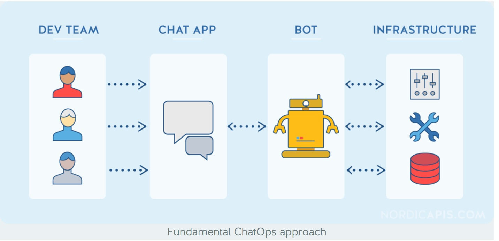

# Introduce ChatOps , a tool to make team communication and collaboration better

ChatOps is a concept or a framework which's purpose is to make team communication and collaboration better. Usually
  there are two main points :

- Put commands and conversation into one fire-room, better to log, co-work and learn.
- Better to use and easily reolve problems with commands in Chat, making everyone pairing every time.

### Architecture Diagram

### Notes 

Currently there are two well-know framework for ChatOps:

- [hubot](https://hubot.github.com/) : implement with Go
- [errbot](http://errbot.io/en/latest/) : played with Python

### Tips & Links

- [A video from Github which is practicing ChatOps](https://www.youtube.com/watch?v=NST3u-GjjFw)
- [A good article to introduce ChatOps](https://blog.hipchat.com/2016/02/05/chatops-guide-evolution-adoption-significance/)  
- [Famous Frameworks for ChatOps](http://nordicapis.com/12-frameworks-to-build-chatops-bots/)
