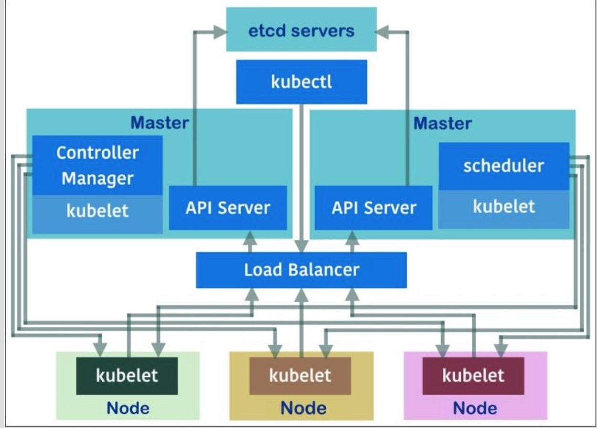
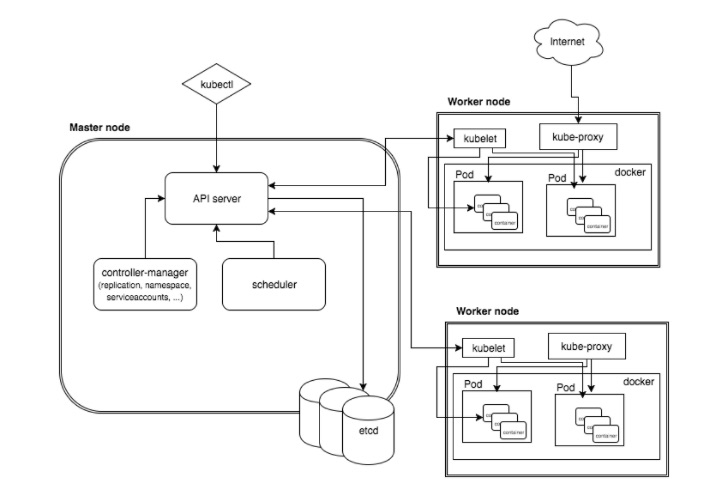

---
### 通过kubeadm快速创建一个Kubernetes Cluster

`kubeadm` 是Kubernetes社区提供的，用于快速搭建Kubernetes Cluster的工具，将原本较为复杂的搭建工作，自动化成命令行，完成了一键搭建Kubernetes Master，并方便其他host，通过命令行快速加入Kubernetes Cluster。

`kubeadm`目前仍处于beta阶段，暂时还不建议投入到生产环境，如需使用，可能需要额外的setup。

Kubernetes的主要组件如图所示：





> #### `kubeadm`的安装步骤

- **配置`Kubernetes Master`节点**

1. 选择合适的操作系统，建议Ubuntu16.04
2. 安装`docker`, `kubelet`, `kubeadm`, `kubectl`

```
apt-get update && apt-get install -y apt-transport-https
curl -s https://packages.cloud.google.com/apt/doc/apt-key.gpg | apt-key add -
```
```
cat <<EOF >/etc/apt/sources.list.d/kubernetes.list
deb http://apt.kubernetes.io/ kubernetes-xenial main
EOF
```
```
apt-get update
# Install docker if you don't have it already.
apt-get install -y docker.io
apt-get install -y kubelet kubeadm kubectl kubernetes-cni
```

3. 配置Kubernetes Master，通过`kubeadm`，创建master节点必要的服务，所有服务除`kubelet`外均以container的方式运行

```
kubeadm init --pod-network-cidr 10.244.0.0/16
```

4. 配置完成后，会得到如下信息

```
Your Kubernetes master has initialized successfully!

To start using your cluster, you need to run (as a regular user):

  sudo cp /etc/kubernetes/admin.conf $HOME/
  sudo chown $(id -u):$(id -g) $HOME/admin.conf
  export KUBECONFIG=$HOME/admin.conf

You should now deploy a pod network to the cluster.
Run "kubectl apply -f [podnetwork].yaml" with one of the options listed at:
  http://kubernetes.io/docs/admin/addons/

You can now join any number of machines by running the following on each node
as root:

  kubeadm join --token <token> <master-ip>:<master-port>
```

说明Kubernetes Master已经安装完成，可以通过得到的token，配置Kubernetes Node，并加入cluster。

```
kubeadm join --token $token $kube-apiserver-ip:$kube-apiserver-port
```

可以通过`kubeadm token list`来查询可用的token

- **配置`Kubernetes Node`节点**

1. 选择合适的操作系统，建议Ubuntu16.04
2. 安装`docker`, `kubelet`, `kubeadm`

```
apt-get update && apt-get install -y apt-transport-https
curl -s https://packages.cloud.google.com/apt/doc/apt-key.gpg | apt-key add -
```
```
cat <<EOF >/etc/apt/sources.list.d/kubernetes.list
deb http://apt.kubernetes.io/ kubernetes-xenial main
EOF
```
```
apt-get update
# Install docker if you don't have it already.
apt-get install -y docker.io
apt-get install -y kubelet kubeadm kubernetes-cni
```

3. 配置Kubernetes Node，通过`kubeadm`，加入Kubernetes Cluster

```
kubeadm join --token $token $kube-apiserver-ip:$kube-apiserver-port
```

4. 配置完成后，会得到如下信息

```
Node join complete:
* Certificate signing request sent to master and response
  received.
* Kubelet informed of new secure connection details.

Run 'kubectl get nodes' on the master to see this machine join.
```

可以在master节点，通过`kubelet get nodes`查询cluster的nodes信息。


> #### `kubeadm`在`init`过程中所做的事情

`kubeadm` 创建Kubernetes Cluster，主要借助于`kubelet`可以独立的运行，完成Pod的管理。

1. 环境检查，确保Host可以用于搭建Kubernetes Cluster；
2. 生成一个随机token，用于其他Kubernetes Node加入Cluster。Token主要用于Node与Cluster进行通信时，`kube-apiserver`的身份认证，确保命令能够运行；
3. 生成一系列`key, cert, 及ca`文件，用于Cluster的其他components与api-server进行通信；
4. 生成kubelet，scheduler，controller-manager用到的config文件，默认放在`/etc/kubernetes`文件夹中；
5. 生成`etcd`, `controller-manager`, `scheduler`, `apiserver`用到的Pod Manifest
6. 创建Master需要的Components，以Pods的方式运行；
7. 配置RBAC规则；
8. 添加必要的`add-on`组件，主要包括`dns`, `kube-proxy`；

Tips:
- [kubeadm安装文档](https://kubernetes.io/docs/getting-started-guides/kubeadm/)
- [kubeadm相关参考资料](https://kubernetes.io/docs/admin/kubeadm/)
- [较为详细的解释kubeadm的主要步骤](https://www.ianlewis.org/en/how-kubeadm-initializes-your-kubernetes-master)


---
#### Kubernetes中实现Replication的方法

>段落中内容来自于 [Kubernetes Replication Controller, Replica Set and Deployments: Understanding replication options](https://www.mirantis.com/blog/kubernetes-replication-controller-replica-set-and-deployments-understanding-replication-options/)

> **为什么需要Replication**

在创建及使用Pod的过程中，为避免单点故障导致服务不可用，Kubernetes提供了replica Pod资源的办法，允许用户使用统一模板创建并管理多个Pod，确保在服务的生命周期内，总有指定数量的Pod在运行；并且通过与负载均衡服务的结合，确保服务最大可能的可用性，同时，增加了服务的横向扩展能力。

> **Kubernetes中提供的Replication的几种方式**

- **[Replication Controller](https://kubernetes.io/docs/user-guide/replication-controller/)**

Replication Controller与Pod一样，是Kubernetes Cluster的一种资源，主要作用在于确保同一时期，Kubernetes Cluster中运行着指定数量的Pod，并通过一定的策略，确保Pod尽量分散在不通的Nodes中；

Replication Controller创建后，通过Kubernetes组件controller-manager，监控者Cluster中所属Pod的数量，当Pods的数量增加时，自动删除；当Pods的数量减少时，自动创建；同时，此种模式，增加了对于Pod横向扩展及动态升级的灵活性，确保在此过程中服务不会中断；

可以通过创建文件`rc.yml`：
```
apiVersion: v1
kind: ReplicationController
metadata:
  name: nginx
spec:
  replicas: 3
  selector:
    app: nginx
  template:
    metadata:
      name: nginx
      labels:
        app: nginx
    spec:
      containers:
      - name: nginx
        image: nginx
        ports:
        - containerPort: 80
```
使用命令`kubectl create -f ./rc.yml`创建事例Replication Controller。

Tips：Replication Controller是通过label selector管理Pod，可以在事例中看到，在创建Pod的过程中，Pod会通过`.spec.template.metadata.labels`被打上`app: nginx`的标签，同时，Replication Controller创建的过程中，会在`.spec.selector`定义一组selector，用于管理符合条件的Pod；在默认情况下，`.spec.selector`与`.spec.template.metadata.labels`相同

- **Replication Sets**

Replication Sets是Kubernetes提出的，下一代Replication Controller的资源类型，本质上与Replication Controller类似，主要的区别在于，Replication Controller在Pod的选择器上，只支持`equal-based`的匹配类型，Replication Sets在此基础上进行了加强，支持`set-based`的匹配类型；

在Replication Sets的使用上，Kubernetes建议通过使用Deployment，间接的使用Replication Sets，通过Deployment维护replica

- **[Deployment](https://kubernetes.io/docs/concepts/workloads/controllers/deployment/)**

Deployment是Kubernetes中的另外一种资源，主要用于替代Replication Controller；Deployment是通过Replication Sets的方式实现replica的功能；在创建Deployment的过程中，通过创建Replication Sets，确保指定数量的Pod的运行；

Deployment提供`declarative`形式的升级；升级Pod的过程中，通过创建新的Replication Sets，移除旧的Replication Sets完成升级，且对于环境中的Pod，Deployment总是确保至少有一定数量的Pod是active的，部分创建新的Pod，并部分移除旧的Pod，交替进行；

Deployment提供`roll-update`及`roll-back`的操作，且每次更改`.spec.template`下的内容，都会更新Deployment的版本，可以通过`kubectl rollout history deployment$your_deployment`查看所有的版本；

通过事例`deployment.yml`创建Deployment
```
apiVersion: apps/v1beta1
kind: Deployment
metadata:
  name: nginx-deployment
spec:
  replicas: 3
  template:
    metadata:
      labels:
        app: nginx
    spec:
      containers:
      - name: nginx
        image: nginx:1.7.9
        ports:
        - containerPort: 80
```
