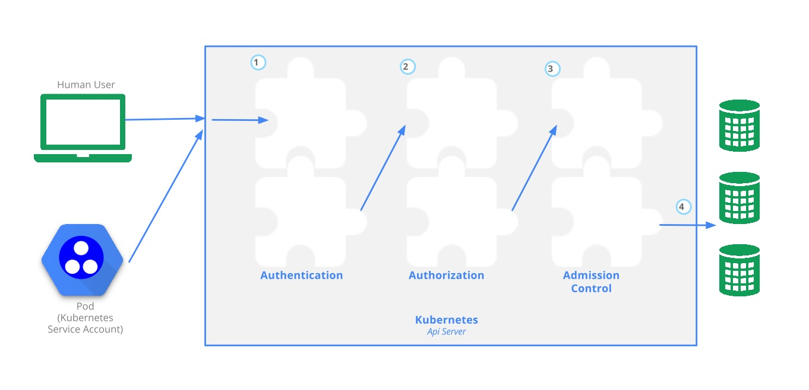

---

### Kubernetes Cluster Installation

> 详细的介绍了如何一步一步搭建kubernetes cluster [follow-me-install-kubernetes-cluster](https://github.com/opsnull/follow-me-install-kubernetes-cluster)

---

### Kubernetes Components

> #### API Server

API Server是kubernetes cluster的访问入口，所有其他components及外部的requests，都需要经过API Server，进行authz， autho，admission control，然后转发给对应的Handler；API Server是唯一一个跟ETCD进行communication的组件。 More [Kubernetes deep dive: API Server – part 1](https://blog.openshift.com/kubernetes-deep-dive-api-server-part-1/)

> #### Controller Managers

Controller Manager 是一个daemon进程，用于保证cluster中的相对应的资源能够顺利，持续的运行，主要有replication controller，endpoint controller， node controller， serviceaccount controller。

> #### Scheduler

Scheduler确保可以为新的Pod找到合适的Node，主要分为三个步骤：1）过滤出可用的node list；2）根据既定规则，对node list进行权重计算；3）选择权重最高的node。 Scheduler在整个过程中涉及两部分的策略：1）过滤部分，如何挑选出合适的node list；2）权重部分：如何计算权重。

More [Advanced Scheduling in Kubernetes](http://blog.kubernetes.io/2017/03/advanced-scheduling-in-kubernetes.html), [The Kubernetes Scheduler](https://github.com/kubernetes/community/blob/master/contributors/devel/scheduler.md), [Scheduler Algorithm in Kubernetes](https://github.com/kubernetes/community/blob/master/contributors/devel/scheduler_algorithm.md)

---

### Kubernetes Resources

> #### Ingress

Ingress作为kubernetes的一种resource，主要负责为Services添加一些rules，使得external connection在访问service的过程中，做一些额外的处理，such as redirect，loadbalancer。

Kubernetes Cluster中，为了使Ingress能够工作，需要创建Ingress Controller及Default Http Backend；Ingress Controller的作用主要是watch api-server requests中关于/ingress的部分，将request结合Ingress进行处理；Default Http Backend主要负责response那些找不到ingress rule的request。

More Info:
- [Ingress Resources](https://kubernetes.io/docs/concepts/services-networking/ingress/)
- [Nginx Ingress Controller](https://github.com/kubernetes/ingress/tree/master/controllers/nginx)
- [Deploying the Nginx Ingress controller](https://github.com/kubernetes/ingress/tree/master/examples/deployment/nginx)

---

### Authentication & Authorization & Admission Control

通常，一个kubernetes的请求需要经历三个阶段，才会被kubernetes cluster接受并处理。流程如图所示：



##### Authentication

##### Authorization

> #### Admission Control

Admission Control主要工作在于，验证用户的请求是否满足所有的Admission Control plugins。

Admission Control是一组plugins，类似于OpenStack `api-paste.ini`中的filter, 用户请求会
  依次通过plugins，只有通过所有的plugins的验证，请求才会真正被kubernetes cluster处理。

Admission Control plugins通过`kube-apiserver`的参数`--admission-control`进行指定，形如

```
--admission-control=NamespaceLifecycle,LimitRanger,ServiceAccount,DefaultStorageClass,ResourceQuota
```

更多的plugins介绍，请参照官方文档[Using Admission Controllers](https://kubernetes.io/docs/admin/admission-controllers/)

---

### Resources & Management

> #### Persistent Volume & Persistent Volume Claim & Storage Class

> Persistent Volume

Persistent Volume, 是Admin预先创建好的volumes，当用户需要使用时，可以通过PVC，与适合的PV进行绑定；当用户用完后，删除
，PV会根据创建时的回收策略进行数据处理，并准备供其他用户使用。

Persistent Volume的回收包括三种：Retain（需要手工进行Reclaim，以便下个用户使用）; Recycle ; Deletation

Persistent Volume的状态主要包括四种：Available ; Bound ; Reclaim ; Failed

> Persistent Volume Claim

Persistent Volume Claim : 用户可以通过PVC，提出volumes的申请，系统会匹配合适的PV进行绑定，供用户使用。

> Storage Class

Storage Class : Storage Class连接后面的Storage Provider，通过它，PVC可以自动完成创建storage volume以及PV，并绑定的操作。

More [Persistent Volumes](https://kubernetes.io/docs/concepts/storage/persistent-volumes/)


> #### ResourceQuota - 用来限制namespace中的资源使用

kubernetes提供了名为ResourceQuota的Object，用于cluster内的资源管理。ResourceQuota主要针对以namespace为单位的资源控制，限制namespace中cpu，memory的使用量及pod等资源的创建数目。一个namespace可以关联多个ResourceQuota。

Tips：当一个namespace关联了ResourceQuota，并且ResourceQuota中限定了cpu，memory的使用，例如`requests.cpu`, `limits.memory`，则创建Pod时需显示的指定每个Pod的cpu, memory等的申请及限制情况。

更多的细节参考 [Resource Quotas](https://kubernetes.io/docs/concepts/policy/resource-quotas/), 也可以通过官方实例更好的了解 [Applying Resource Quotas and Limits](https://kubernetes.io/docs/tasks/administer-cluster/apply-resource-quota-limit/)

---

### Cluster Monitor

> #### Liveness Probe & Readiness Probe

Liveness Probe 及 Readiness Probe 主要用于Pod中，确保Pod的创建及运行能够正常运行，并在必要的时候删除并重新创建Pod

- Readiness Probe : 主要用于Pod创建之后，只有当Readiness Probe检测通过，才能确保Pod已经准备好提供服务，Pod的状态将会变成Running并添加到Service的endpoint list
- Liveness Probe : 主要用于Pod运行过程中，周期性的检测Pod的运行状态，当Pod处于不正常状态，例如：显示运行，但已无法提供任何服务，处于Hanging状态，能够及时删除当前Pod，并创建一个新的Pod，确保尽量小的受到影响

Probe主要提供几种方式的检测，包括

- `exec`: 执行command，检测环境状态
- `httpGet` : 通过HTTP及指定的检测链接，检测环境状态
- `tcpSocket` : 通过TCP及提供的相关参数，检测环境状态

详尽信息及举例可参照 [Configuring Liveness and Readiness Probes](https://kubernetes.io/docs/tasks/configure-pod-container/configure-liveness-readiness-probes/)

---