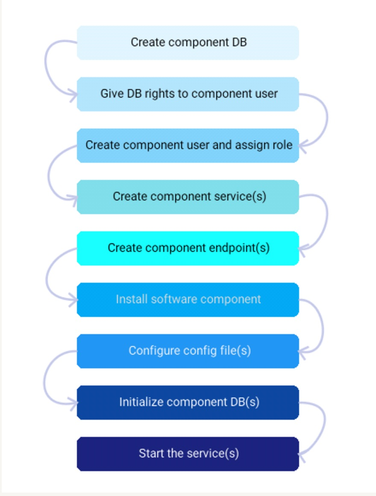
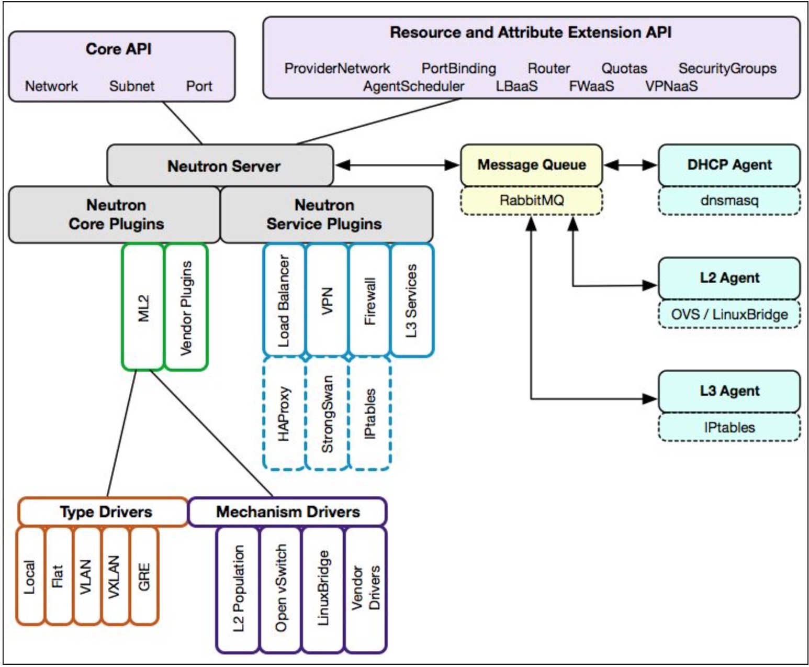
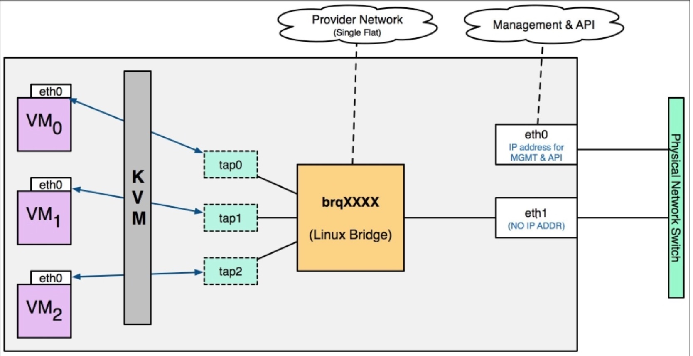
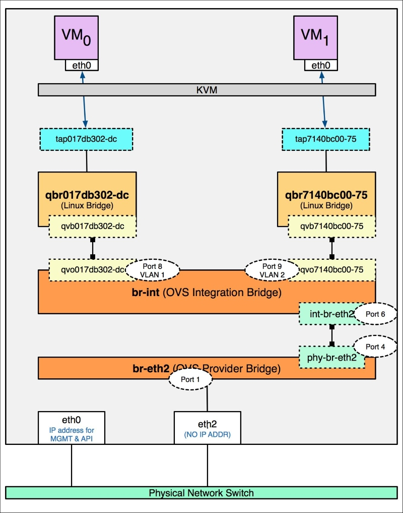

#### Gather some OpenStack knowledge and diagrams

---

#### Common Part

##### This is one diagram to show difference amount IaaS, PaaS, and SaaS

##### This is one diagram to show a common flow to install and configure one OpenStack component.

---

#### Neutron Part

##### This is one diagram to show architecture of Neutron component

##### This is one flow to show data traffic with mechanism "linuxbridge" and type is "vlan"

##### This is one flow to show data traffic with mechanism "openvswitch" and type is "vlan"

